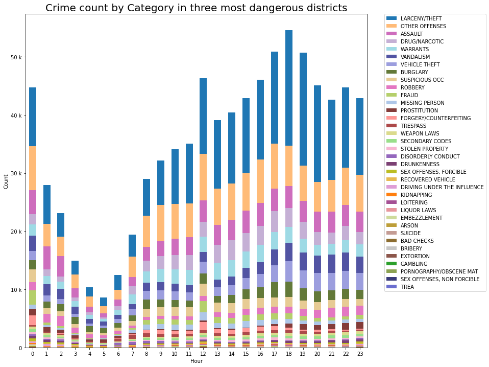
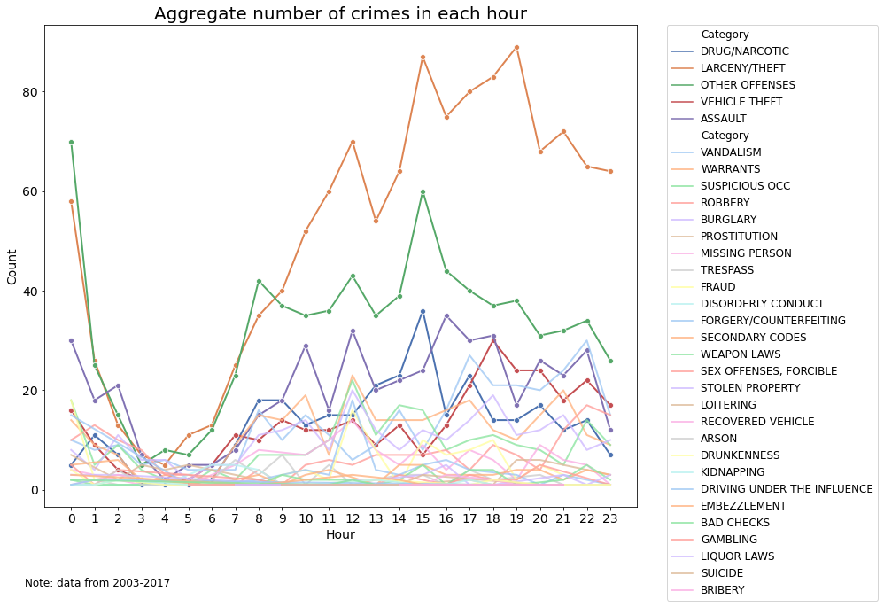
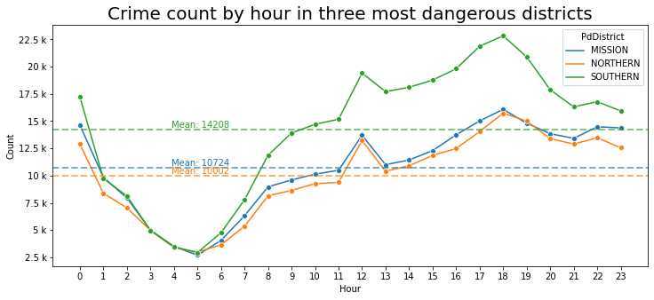
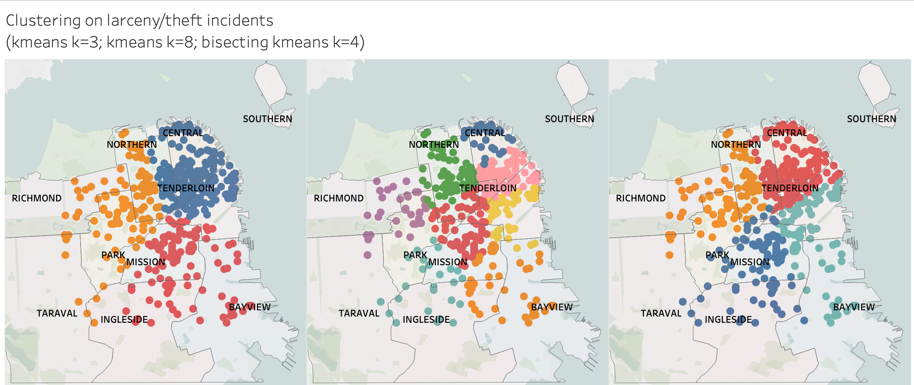
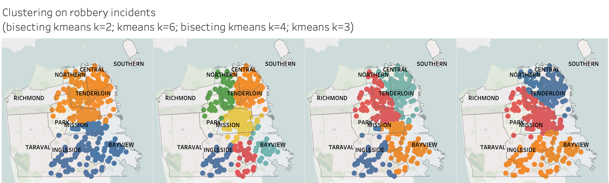

# SF-crime-analysis-in-Apache-Spark

In this notebook, I performed data and spatial analysis on a 15-year SFPD crime dataset of size over 551MB. The dataset I used is historical SFPD incident reports data from 2003 to 2018/05/15.

## Part 1 OLAP and Data Visualization
In part 1, I conducted big data OLAP (Online Analytical Processing) based on Spark RDD, DataFrame, and Spark SQL. I compared variation in crime rates and resolution percentage of different categories across districts over time, conducted data visualiazation by seaborn, matplotlib, pyplot and Tableau, analyzed results and provided suggestions for the traveler, policymaker, and police arrangement.

Some data visualization examples:

- Stacked bar chart of hourly crime count grouped by crime category, with layers ordered by descending frequency 
 

- Grouped line chart by category of aggregate hourly crime in top 3 dangerous districts, with emphasis hue on most frequent crime 
 

- Donut chart of resolution percentage of most frequent crimes, with emphasis hue on unresolved wedge

- Grouped line chart of hourly crime count in top 3 dangerous districts with mean annotation line 
 

## Part 2 Clustering
In Part 2, I conducted spatial data analysis and built K-means and bisecting K-means clustering model to explore and visualize the variation of the spatial distribution of larcency/theft and robbery.

A quick look at the visualization of clustering results:
- Larceny/Theft

- Robbery

